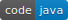
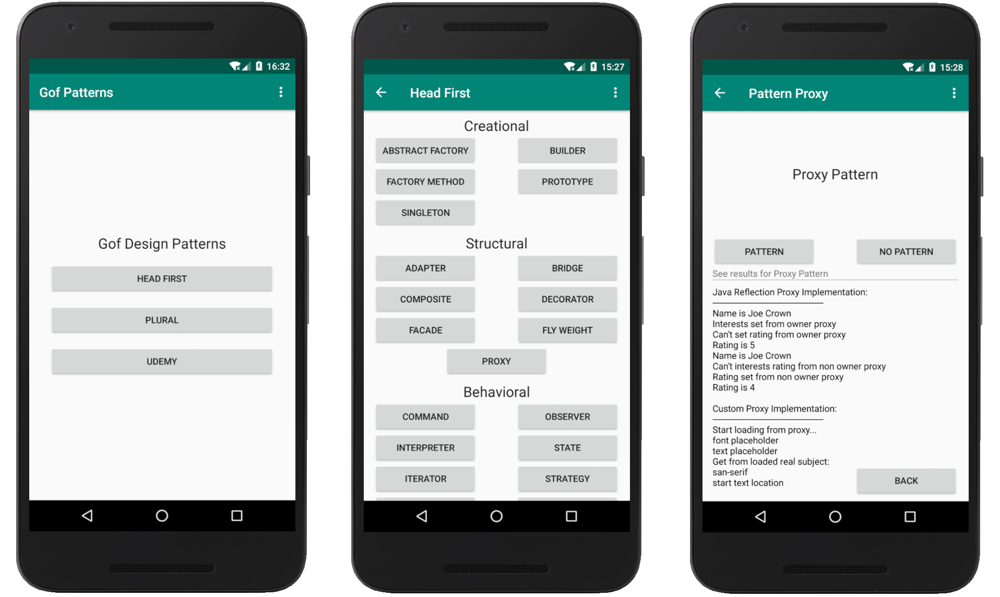

  

## Gof Design Patterns

An Android application which demonstrates source code of GoF design patterns from the next sources:

1. The book  ["Head First Design Patterns"](https://www.amazon.com/Head-First-Design-Patterns-Brain-Friendly/dp/0596007124/ref=sr_1_1?dchild=1&keywords=Head+First+Design+Patterns%3A+A+Brain-Friendly+Guide&qid=1592750140&s=books&sr=1-1) by E.Freeman, E.Freeman, K.Sierra, B.Bates  © O'Reilly 2004
2. The course ["Design Patterns in Java"](https://www.pluralsight.com/paths/design-patterns-in-java) by Bryan Hansen, Jose Paumard  © Pluralsight 2016
3. The course ["Gof Patterns Java from Makedonsky"](https://www.udemy.com/course/java-patterns/) by Alex Makedonsky © Udemy 2019

### Introduction
This demo presents Gof Design Patterns for all three sources, which are named as "Head First", "Pluralsight" and "Udemy".
Every pattern source code has two versions, one uses pattern, another one not. 
Code with pattern is placed in "sol" package.  Code that does not use pattern is in "pre" package. 
Head First  patterns have descriptions with class diagrams for every pattern.

- first diagram show classic UML diagram for pattern. 
- second diagram is UML diagram for code that does not use pattern( package "pre").
- third diagram shows UML class diagram  for real code that uses pattern (package "sol").

Notes. Not all patterns have "pre" version, but the number of such exceptions is small.
Pluralsight and Udemy patterns don't have UML diagrams, this is subject for TBD.

### Navigation
These are screens of application. Every button is self explained. 
- to show the result of code that uses pattern,  click on "Pattern" button; 

- to show the result of code w/o pattern, click on "No Pattern" button.

The screen of patterns is scrollable, use scrolling to show buttons  that are not visible.
The output text window in pattern screen is scrollable. Use scrolling to show the results.
Use "Back" button to return to previous screen.

  

 

### Head First  Patterns 
There are three main groups of Gang of Four Design Patterns  Creational, Structural and Behavioral.
#### Creational
- [Abstract Factory](https://github.com/v777779/gof_design_patterns/)	
- Factory Method     
- Singleton                   
- Builder
- Prototype
#### Structural
- Adapter
- Composite
- Facade
- Bridge 
- Decorator
- Fly Weight
- Proxy
#### Behavioral
- Command
- Interpreter
- Iterator
- Mediator
- Memento
- Observer
- State
- Strategy
- Template Method
- Visitor
- Chain of responsibility

###  Readings
- ["Head First Design Patterns"](https://www.amazon.com/Head-First-Design-Patterns-Brain-Friendly/dp/0596007124/ref=sr_1_1?dchild=1&keywords=Head+First+Design+Patterns%3A+A+Brain-Friendly+Guide&qid=1592750140&s=books&sr=1-1) by E.Freeman, E.Freeman, K.Sierra, B.Bates  © O'Reilly 2004
- ["Design Patterns: Elements of Reusable Object-Oriented Software (Addison-Wesley Professional Computing Series) "](https://www.amazon.com/Design-Patterns-Object-Oriented-Addison-Wesley-Professional-ebook/dp/B000SEIBB8) by E.Gamma, R.Helm, R.Johnson, J.Vissides  © 1995 by Addison-Wesley
### Contributors
[@Vadim Voronov  2020](https://github.com/v777779)

*Published  21.06.2020.*

