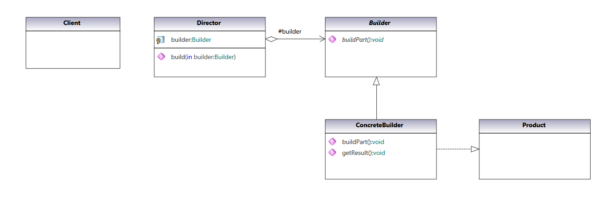
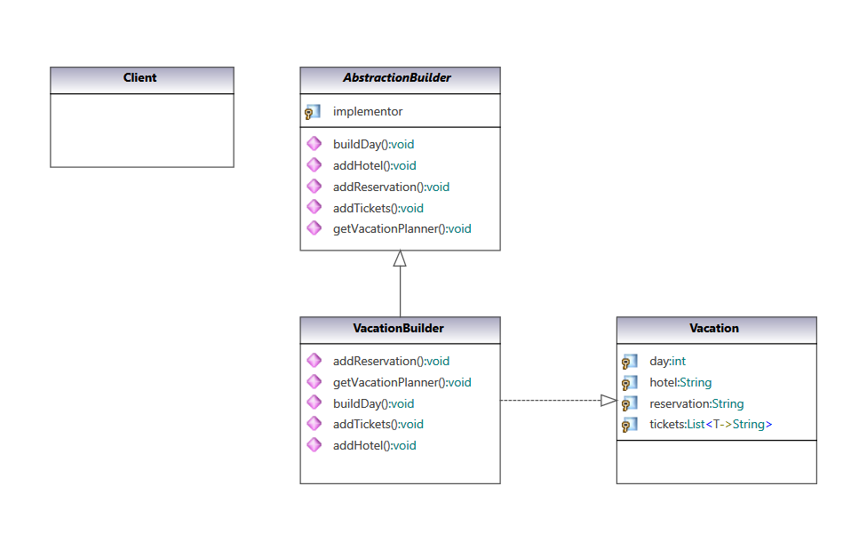

### Builder Pattern

Separate the construction of a complex object from its representation, allowing the same construction process to create various representations.

#### UML Class Diagram:

Classic definition from  [Gang of Four Design Patterns)](https://www.amazon.com/Design-Patterns-Object-Oriented-Addison-Wesley-Professional-ebook/dp/B000SEIBB8) 

 

#### Code implementation w/pattern

UML Class diagram for [code with pattern](../../app/src/main/java/com/example/gofp/head_first/sol/creational/builder) from [Head First Design Patterns](https://www.amazon.com/Head-First-Design-Patterns-Brain-Friendly/dp/0596007124) :

 

#### Code implementation w/o pattern

UML Class diagram and [code without pattern](../../app/src/main/java/com/example/gofp/head_first/pre/creational/builder)  are not implemented.