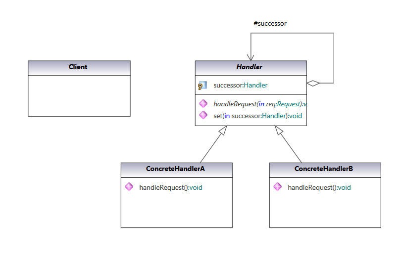
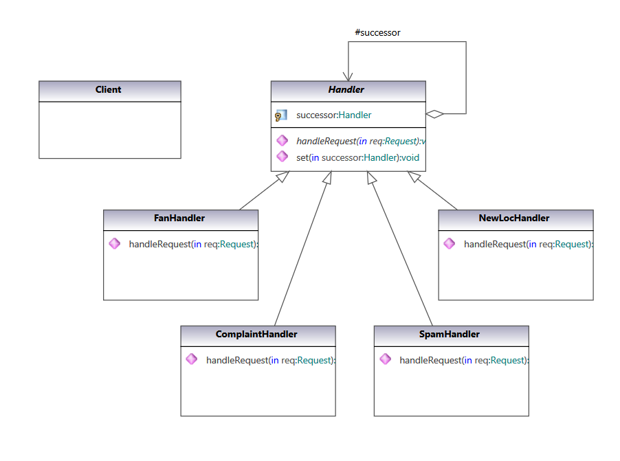
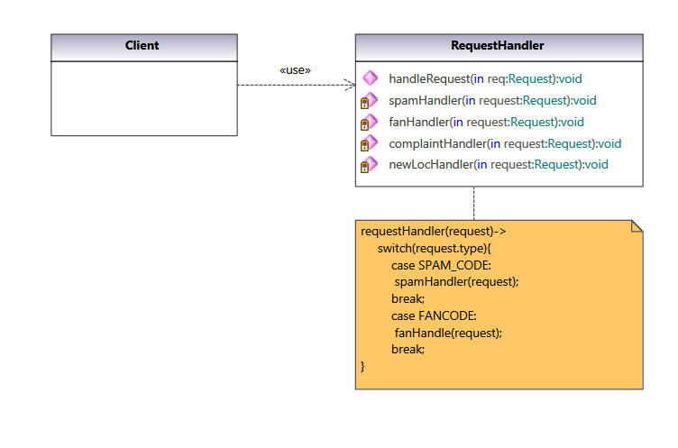

### Chain Of Responsibility Pattern

Avoid coupling the sender of a request to its receiver by giving more than one object a chance to handle the request. Chain the receiving objects and pass the request along the chain until an object handles it.

#### UML Class Diagram:

UML class diagram of pattern from  [Gang of Four Design Patterns)](https://www.amazon.com/Design-Patterns-Object-Oriented-Addison-Wesley-Professional-ebook/dp/B000SEIBB8) 

 

#### Code implementation w/pattern

UML class diagram of [code with pattern](../../app/src/main/java/com/example/gofp/head_first/sol/behavioral/chain_of_responsibility) from [Head First Design Patterns](https://www.amazon.com/Head-First-Design-Patterns-Brain-Friendly/dp/0596007124) :

 

#### Code implementation w/o pattern

UML class diagram of [code without pattern](../../app/src/main/java/com/example/gofp/head_first/pre/behavioral/chain_of_responsibility) from [Head First Design Patterns](https://www.amazon.com/Head-First-Design-Patterns-Brain-Friendly/dp/0596007124) :

 