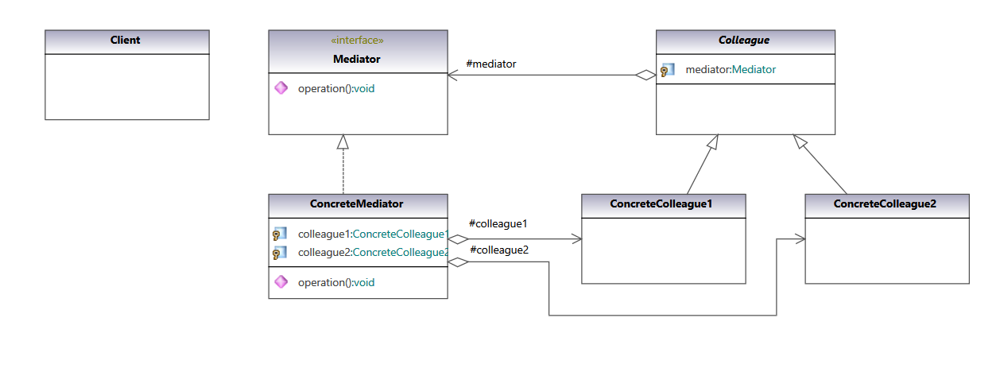
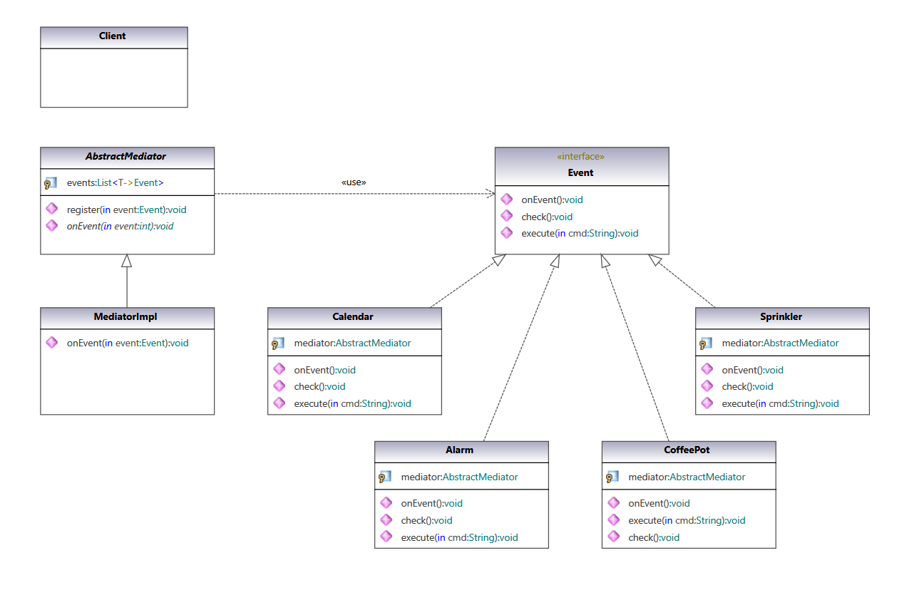
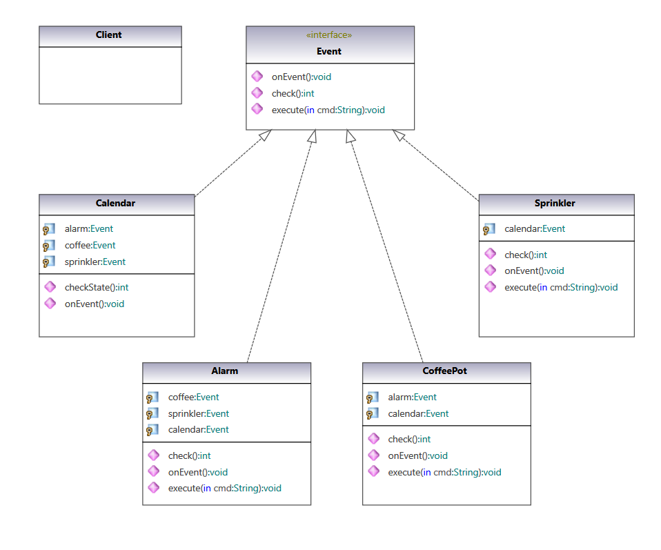

### Mediator Pattern

Define an object that encapsulates how a set of objects interact. Mediator promotes loose coupling by keeping objects from referring to each other explicitly, and it allows their interaction to vary independently.

#### UML Class Diagram:

UML class diagram of pattern from  [Gang of Four Design Patterns)](https://www.amazon.com/Design-Patterns-Object-Oriented-Addison-Wesley-Professional-ebook/dp/B000SEIBB8) 

 

#### Code implementation w/pattern

UML class diagram of [code with pattern](../../app/src/main/java/com/example/gofp/head_first/sol/behavioral/mediator) from [Head First Design Patterns](https://www.amazon.com/Head-First-Design-Patterns-Brain-Friendly/dp/0596007124) :

 

#### Code implementation w/o pattern

UML class diagram of [code without pattern](../../app/src/main/java/com/example/gofp/head_first/pre/behavioral/mediator) from [Head First Design Patterns](https://www.amazon.com/Head-First-Design-Patterns-Brain-Friendly/dp/0596007124) :

 
