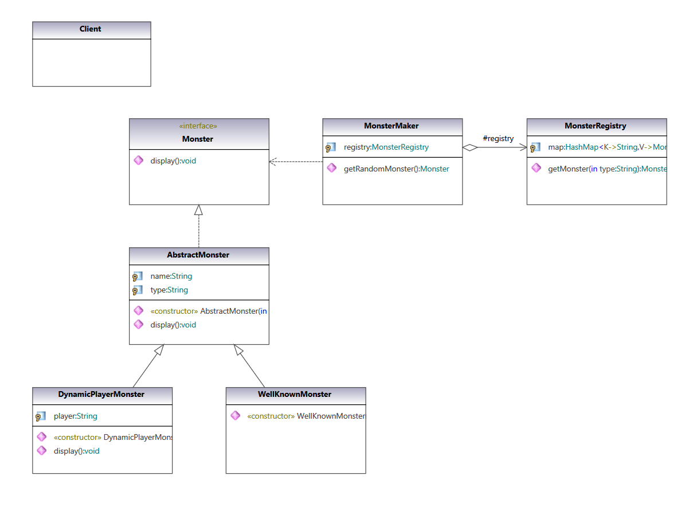

### Prototype Pattern

Specify the kinds of objects to create using a prototypical instance, and create new objects from the 'skeleton' of an existing object, thus boosting performance and keeping memory footprints to a minimum.

#### UML Class Diagram:

UML class diagram of pattern from  [Gang of Four Design Patterns)](https://www.amazon.com/Design-Patterns-Object-Oriented-Addison-Wesley-Professional-ebook/dp/B000SEIBB8) 

 

#### Code implementation w/pattern

UML class diagram of [code with pattern](../../app/src/main/java/com/example/gofp/head_first/sol/creational/prototype) from [Head First Design Patterns](https://www.amazon.com/Head-First-Design-Patterns-Brain-Friendly/dp/0596007124) :

 

#### Code implementation w/o pattern

UML class diagram of [code without pattern](../../app/src/main/java/com/example/gofp/head_first/pre/creational/prototype) from [Head First Design Patterns](https://www.amazon.com/Head-First-Design-Patterns-Brain-Friendly/dp/0596007124) :

 