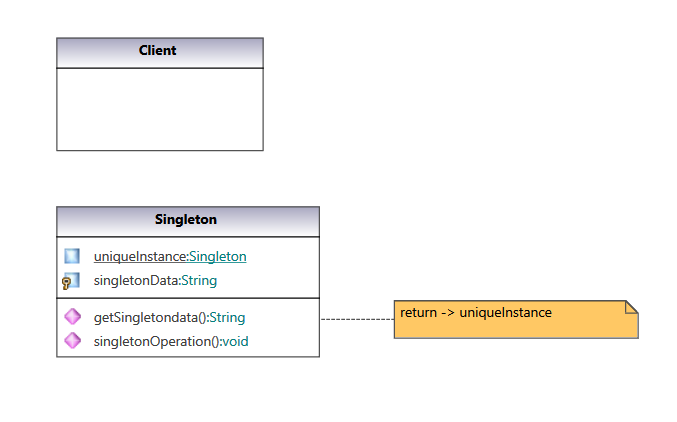
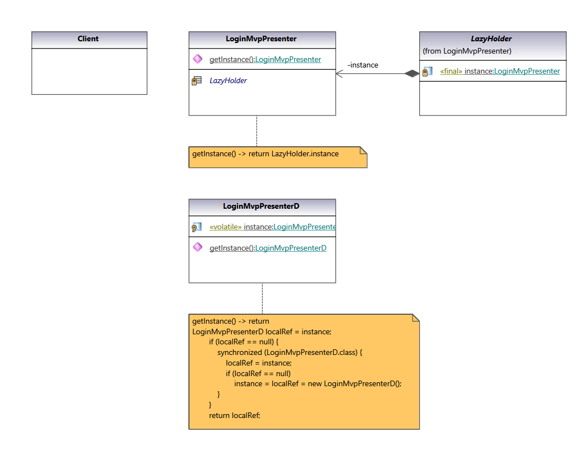

### Singleton Pattern

Ensure a class has only one instance, and provide a global point of access to it.

#### UML Class Diagram:

Classic definition from  [Gang of Four Design Patterns)](https://www.amazon.com/Design-Patterns-Object-Oriented-Addison-Wesley-Professional-ebook/dp/B000SEIBB8) 

 

#### Code implementation w/pattern

UML Class diagram for [code with pattern](../../app/src/main/java/com/example/gofp/head_first/sol/creational/singleton) from [Head First Design Patterns](https://www.amazon.com/Head-First-Design-Patterns-Brain-Friendly/dp/0596007124) :

 

#### Code implementation w/o pattern

UML Class diagram and [code without pattern](../../app/src/main/java/com/example/gofp/head_first/pre/creational/singleton)  are not implemented.
